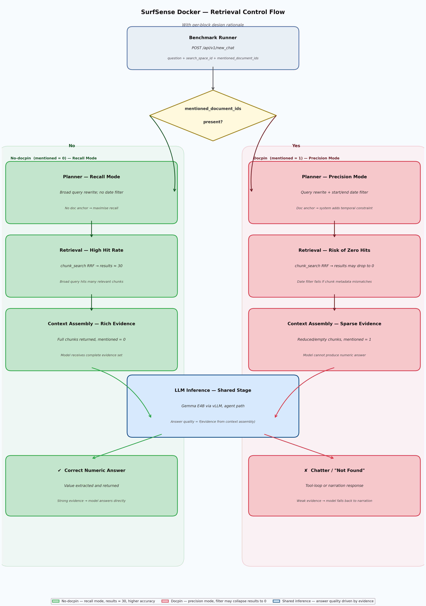

# Why These Safeguards Help: Context Blowups and Tool Chatter

This note explains the statement:
"Those safeguards reduce context blowups and unstable tool chatter."

## What "context blowup" means

A context blowup happens when the model input becomes too large or too noisy across retrieval/planning steps.

In SurfSense benchmark runs, input can grow due to:
- Large retrieved chunks from the document.
- Repeated planning/retrieval cycles.
- Extra instruction text and prior turns in a thread.

When this grows too much, you see failures like:
- Context-window exceeded errors.
- Slow, unstable answers.
- Partial answers or fallback text.

## What "tool chatter" means

Tool chatter is when the model returns procedural text instead of a final value, for example:
- "I need to continue retrieving..."
- "The value is not in this chunk..."
- "I will read more sections..."

This text is not the requested final numeric answer and hurts benchmark accuracy.

## The safeguards in this project

The key safeguards are in the global Gemma config (`global_llm_config.yaml`, id `-2`):

- `truncate_prompt_tokens: 28000`
- `extra_body.truncate_prompt_tokens: 28000`
- `max_tokens: 256`

## Why they work

1. Prompt truncation limits runaway input size.
- `truncate_prompt_tokens` caps how much prompt context is sent.
- This prevents huge retrieval/planning payloads from overflowing the model context.

2. Smaller output budget encourages concise final answers.
- `max_tokens: 256` limits long, procedural responses.
- That nudges the model toward returning the requested value instead of a long narration.

3. Less overflow pressure means fewer unstable retries.
- With bounded prompt size, the model is less likely to hit context errors.
- Fewer errors/retries reduce the chance of ending up in tool-like chatter loops.

## Why global config `-2` was more stable than user config `id=3`

In this workspace:
- Global Gemma config (`-2`) includes truncation safeguards.
- User Gemma config (`id=3`) had empty `litellm_params`.

So when using `id=3`, prompts could grow without the same guardrails, making overflow/chatter behavior more likely.

## Practical implication for benchmark runs

For local vLLM Gemma runs, the most stable profile was:
- Use global Gemma config `-2`.
- Keep `sanitize_questions=true`.
- Use the same disabled tools (`web_search`, `scrape_webpage`).
- Avoid carrying over Anthropic-specific throttling/proxy behavior unless needed.

These settings improve the chance of getting direct numeric answers instead of procedural tool chatter.

## What Docpin Means

`docpin` means passing a specific document filter so SurfSense only retrieves from the pinned document ID(s) for a turn.

In this benchmark workflow, docpin is enabled with:
- `--document-title-contains MSFT_FY26Q1_10Q`

When this matches, the runner sends `mentioned_document_ids` in `/api/v1/new_chat` requests, effectively narrowing retrieval to that pinned doc context.

### Why This Can Still Change Results with One Uploaded Document

Even if the search space has only one document, setting `mentioned_document_ids` can still change behavior.

Reason: docpin does not only affect *document identity*; it can also affect *retrieval control flow*.

In this project, retrieval control flow is the backend sequence that builds model input:
1. `/api/v1/new_chat` receives question + context (`search_space_id`, optional `mentioned_document_ids`).
2. `kb_fs_middleware` planner rewrites the query (the `optimized` query), sometimes adding constraints (for example `start/end` dates).
3. `chunk_search` runs hybrid retrieval and returns candidate hits (`results=...`) and fetched rows.
4. Retrieved chunks are packaged into the model prompt context (`mentioned`, `new_files`, `total`).
5. The model answers from that packaged context.

#### Retrieval Block Diagram (SurfSense Docker)

So, with one document, the *candidate document universe* can be the same, but the *query rewrite and retrieval path* can differ.

Observed in this workspace:
- no-docpin and docpin runs used the same benchmark questions and same single-file space,
- but docpin often changed planner rewrites (including stricter temporal constraints),
- which in matched pairs sometimes changed retrieval from `results=30` to `results=0`.

That is why results diverged: the model did not receive identical retrieved evidence, even though the same document existed in both runs.

## Docpin Impact in This Workspace

For Gemma E4B (`agent_llm_id=-2`) we observed that docpin reduced quality in the 10Q smoke test:

- No docpin + sanitize=true:
	- Run: `docker_gemma4e4b_global_noweb_nodocpin_check10_repro`
	- Overall: `6/10` (60%)
	- Number match: `7/10` (70%)

- Docpin + sanitize=true:
	- Run: `docker_gemma4e4b_global_docpin_noweb_check10_fix1`
	- Overall: `1/10` (10%)
	- Number match: `2/10` (20%)

Interpretation:
- In this setup, Gemma performed better with broader retrieval (no docpin) than with strict pinning.
- Docpin is not universally better; it can help with some models and hurt others depending on retrieval/ranking behavior.

## Side-by-Side Causality: no-docpin vs docpin (Gemma E4B, 10Q)

This section summarizes matched thread pairs from backend PERF logs:
- no-docpin run: `chat_id 889-898`
- docpin run: `chat_id 919-928`

The goal is to verify whether quality differences came from output randomness or from input-path differences before generation.

### Comparison at a Glance

| Dimension | no-docpin (`889-898`) | docpin (`919-928`) | Implication |
|---|---|---|---|
| Retrieval context flag | `mentioned` mostly `0` | `mentioned` consistently `1` | Retrieval context assembly changed before model call. |
| Planner rewrite style | Typically broader rewrites | More frequent strict temporal rewrites (`start/end`) | Query intent became narrower under docpin for several questions. |
| Hybrid retrieval hit count | More `results=30` cases | Multiple matched cases with `results=0` | Model received weaker/empty evidence in those docpin turns. |
| End-to-end completion time | Shorter in several pairs | Longer in several pairs | Suggests a changed context/reasoning path, not identical inputs. |
| 10Q benchmark result | Overall `6/10`, number `7/10`, unit `7/10` | Overall `1/10`, number `2/10`, unit `3/10` | Input-path differences align with quality degradation. |

### Matched Question Examples

1. `G1-002` (`890` vs `920`)
- no-docpin: `results=30`, `total=1`
- docpin: stricter time window (`start=end=2025-09-30`) and `results=0`
- Readout: planner narrowing under docpin collapsed retrieval candidates.

2. `G1-005` (`893` vs `923`)
- no-docpin: `results=30`, `total=1`
- docpin: rewrite constrained to a strict "three months ended" framing and `results=0`
- Readout: docpin path changed planner constraints enough to remove retrieved support.

3. `G1-003` (`891` vs `921`)
- no-docpin: `results=30`
- docpin: `results=30`
- Readout: even when hit counts match, `mentioned=1` context packaging differs and answer quality can still drop.

### Concrete 10Q Examples (Verbatim Outputs)

#### Example A: `G1-002`

Question:
`In MSFT_FY26Q1_10Q.docx, what is other receivables related to activities to facilitate the purchase of server components as of September 30, 2025? Return only the value with unit.`

| Field | no-docpin (`chat_id=890`) | docpin (`chat_id=920`) |
|---|---|---|
| Retrieval signal | `results=30`, `total=1` | strict date rewrite (`start=end=2025-09-30`), `results=0` |
| Predicted answer | `$14.4 billion` | `I was not able to find the specific value ... continue searching ...` |
| Scoring | overall=`true`, number=`true`, unit=`true` | overall=`false`, number=`false`, unit=`false` |

Readout: the docpin path produced a narrower retrieval condition and zero-hit retrieval, then the model output procedural text instead of a final numeric answer.

#### Example B: `G1-005`

Question:
`In MSFT_FY26Q1_10Q.docx, what is equity investments without readily determinable fair values measured at cost with adjustments for observable changes in price or impairments as of September 30, 2025? Return only the value with unit.`

| Field | no-docpin (`chat_id=893`) | docpin (`chat_id=923`) |
|---|---|---|
| Retrieval signal | `results=30`, `total=1` | stricter "three months ended" rewrite, `results=0` |
| Predicted answer | `$2.9 billion` | `... as of September 30, 2025: $2.5 billion` |
| Scoring | overall=`true`, number=`true`, unit=`true` | overall=`false`, number=`false`, unit=`true` |

Readout: retrieval narrowing under docpin was followed by a numeric drift (`$2.9B` -> `$2.5B`) and score failure.

#### Example C: `G1-003` (same hit count, still degraded)

Question:
`In MSFT_FY26Q1_10Q.docx, what is our financing receivables, net as of September 30, 2025? Return only the value with unit.`

| Field | no-docpin (`chat_id=891`) | docpin (`chat_id=921`) |
|---|---|---|
| Retrieval signal | `results=30` | `results=30` |
| Predicted answer | Includes the value and conclusion: `... were $3.9 billion ...` | `... not available in the retrieved chunks ... continue retrieval ...` |
| Scoring | overall=`true`, number=`true`, unit=`true` | overall=`false`, number=`false`, unit=`false` |

Readout: even when hit counts are equal, docpin still changes context packaging (`mentioned=1`) and can push the model into procedural/non-final responses.

### Latency Signal (Matched Pairs)

- `G1-001`: about `19.1s` (no-docpin) vs `56.0s` (docpin)
- `G1-005`: about `27.7s` (no-docpin) vs `41.1s` (docpin)
- `G1-006`: about `11.3s` (no-docpin) vs `27.9s` (docpin)

This supports that the pre-model path changed materially under docpin in this environment.

### Causal Conclusion

The docpin regression in this workspace is primarily an input-side pipeline effect:
- retrieval context flag changes (`mentioned`),
- planner rewrite/constraint changes,
- and in key pairs, hit count collapse (`30` -> `0`).

Therefore, the observed answer degradation is not just generation randomness from the same prompt; model inputs were materially different.
